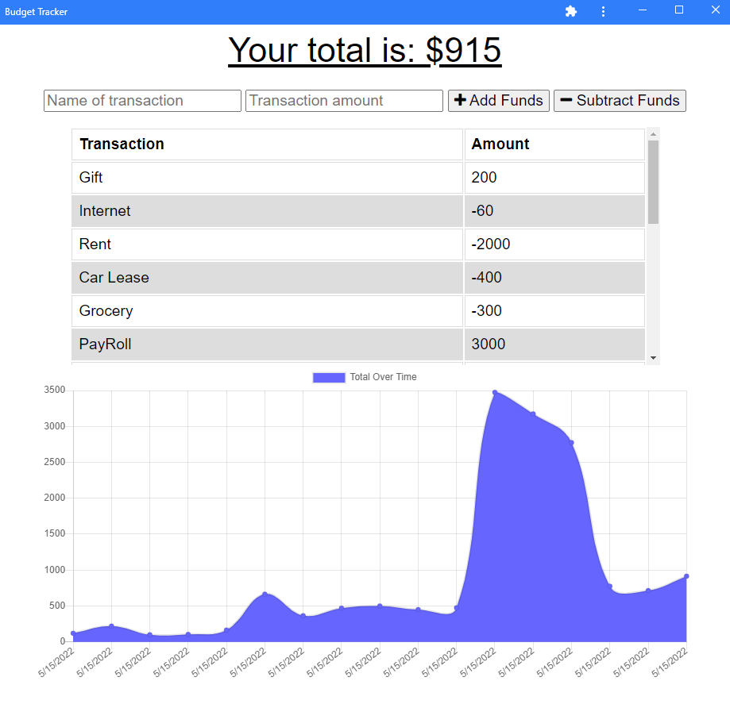

# Budget-Tracker

## Description
Budget Tracker is an application that allows the user to track their money, by giving them the possibility to add expenses and deposits to their budget with or without a connection.

 ## Table of Contents

  - [Installation](#installation)
  - [Usage](#usage)  
  - [License](#license)
  - [Contributing](#contributing)  
  - [Questions](#questions)

  ## Installation

  The user can access the application directly going to the app's URL. However, the user also have the possibility of installing the application by following these steps:

  1. On your computer, open Chrome.
  2. Go to https://sleepy-garden-95445.herokuapp.com/ .
  3. At the top right of the address bar, click Install ➕.
  4. Follow the onscreen instructions to install the PWA.

  ## Usage

  The following image shows the web application's appearance and functionality:
  
  

  URL of deployed application:

  https://sleepy-garden-95445.herokuapp.com/ 

 ## License

  
  This project is licensed under MIT license. 

  ## Contributing
  
  If you like to contribute to this application, please refer to the following guidelines:

  Please refer to the Contributor Covenant v2.1 in the following  website: https://www.contributor-covenant.org for guidelines details on how to contribute
 

  ## Questions

  You can find me on Github: [cdona0908](https://github.com/cdona0908)  
  Any questions? Email me to : celiamdona@gmail.com
 